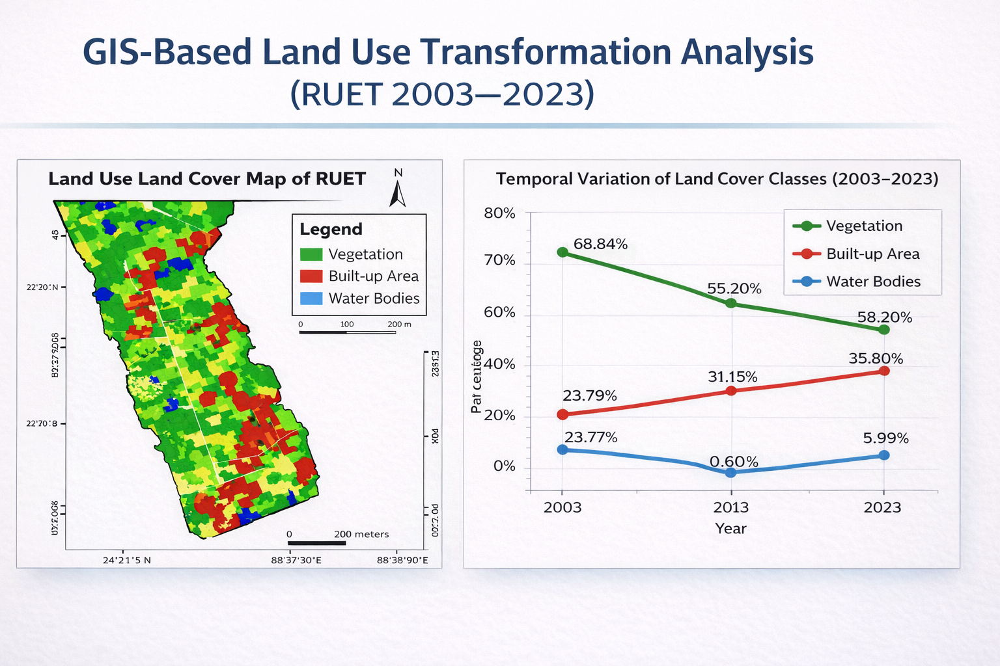
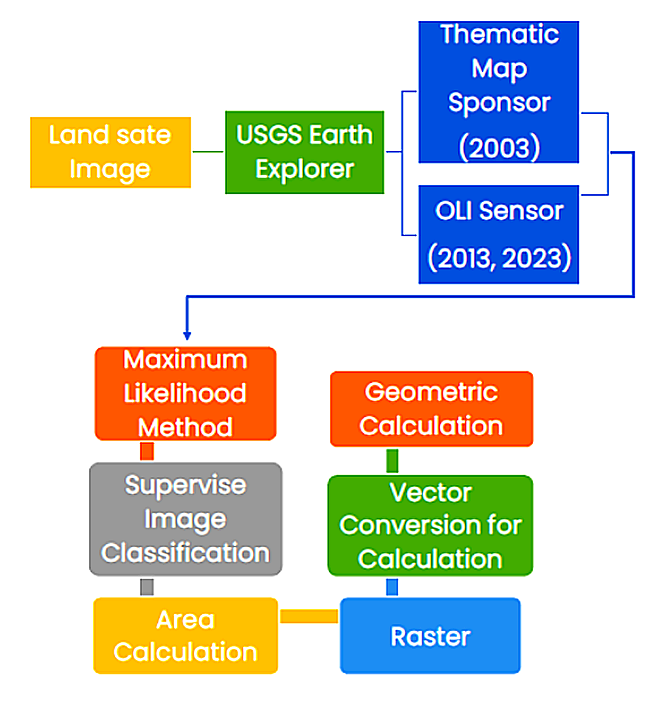
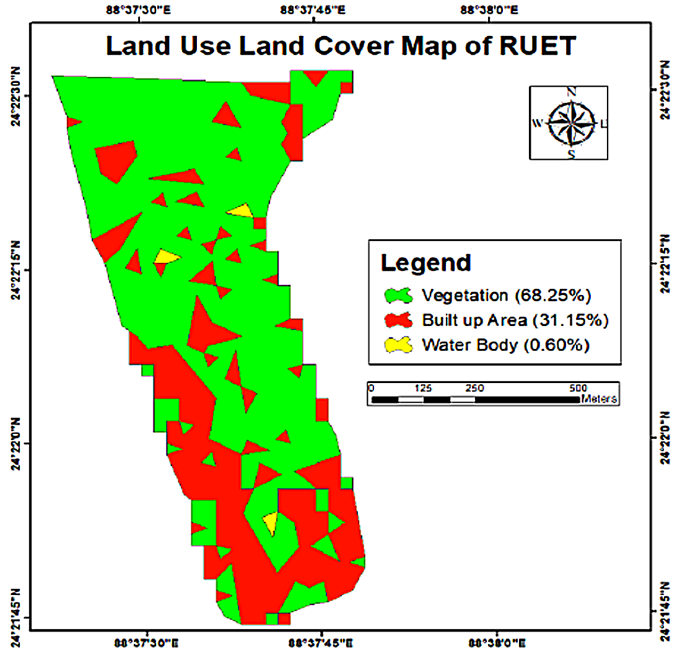
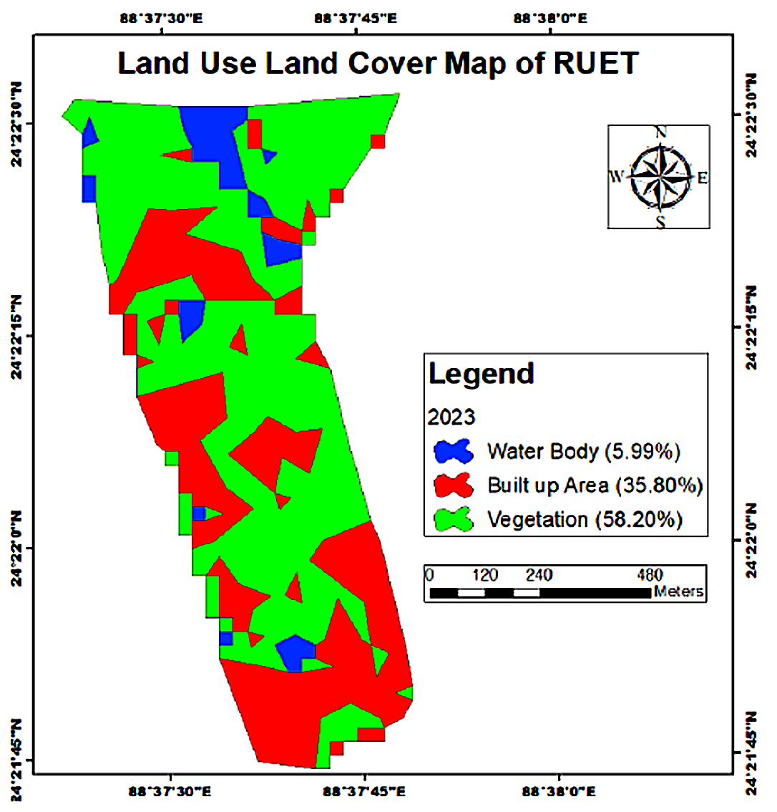
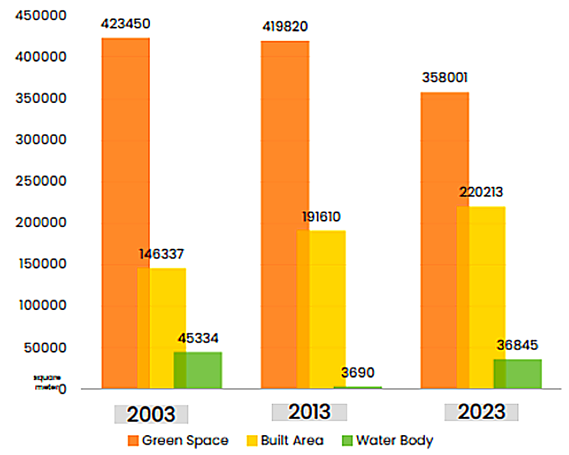
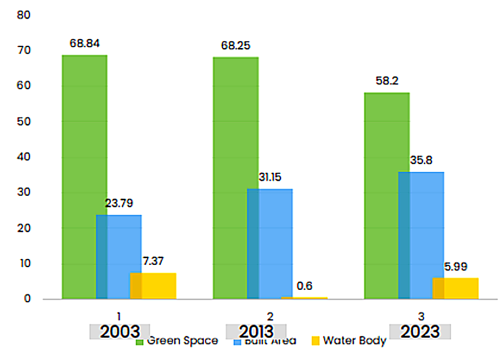
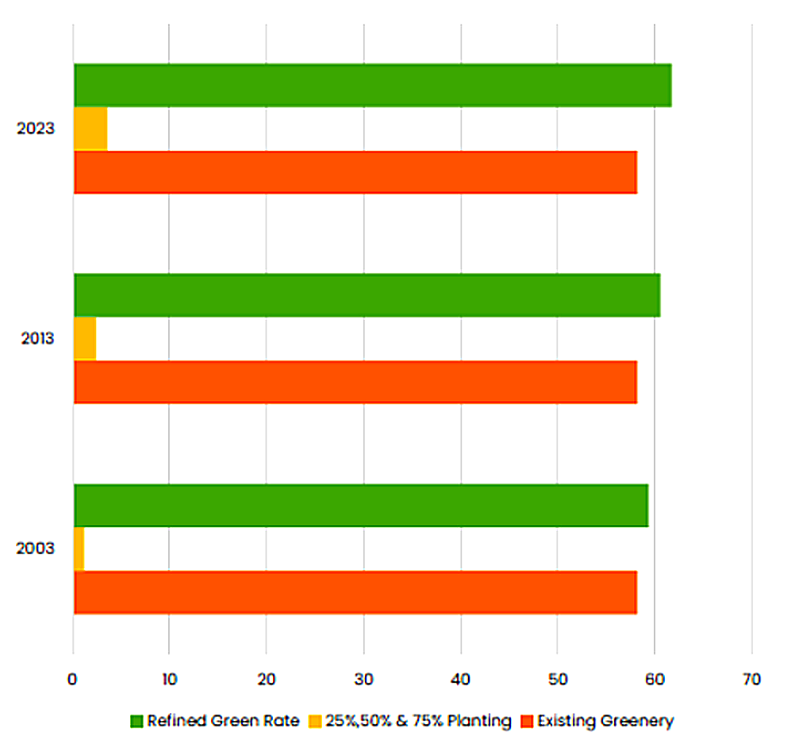

# 🌍 GIS-Based Land Use Transformation Analysis  
## 📍 RUET Campus (2003–2023)

<p align="center">
  
</p>

<p align="center">
  <b>Engineering Technical Project</b><br>
  GIS | Remote Sensing | LULC Analysis | Sustainable Planning
</p>

---

## 🚀 Project Overview

This project presents a GIS-based engineering assessment of Land Use and Land Cover (LULC) transformation within the Rajshahi University of Engineering & Technology (RUET) campus over a 20-year period (2003–2023).

Using Landsat satellite imagery and ArcGIS-based spatial analysis, the study quantifies environmental changes caused by infrastructural expansion and evaluates strategic solutions for ecological recovery.

---

## 🎯 Objectives

- Analyze temporal LULC changes using satellite imagery  
- Quantify variation in vegetation, built-up area, and water bodies  
- Evaluate environmental impact of infrastructural development  
- Assess green space recovery through plantation strategies  

---

## 🛰️ Methodology

<p align="center">
  
</p>

- Satellite Data: Landsat (2003, 2013, 2023)  
- GIS Software: ArcGIS  
- Classification Method: Supervised (Maximum Likelihood)  
- Analysis: Spatial, temporal, and area-based  

---

## 🗺️ Land Use Land Cover Maps

### 📌 2003
<p align="center">
  
</p>

### 📌 2013
<p align="center">
  
</p>

### 📌 2023
<p align="center">
  
</p>

---

## 📊 Temporal Analysis

<p align="center">
  
</p>

- Green space decreased by **10.64%**  
- Built-up area increased significantly  
- Water bodies exhibited irregular fluctuations  

---

## 📈 Area-Based Analysis

<p align="center">
  
</p>

The results indicate a direct inverse relationship between vegetation and built-up areas, confirming that infrastructural expansion occurs at the expense of ecological space.

---

## 🌱 Green Space Recovery Potential

<p align="center">
  
</p>

- Best scenario: **75% plantation strategy**  
- Recovery of **33.46% of lost vegetation**  
- Net increase: **+3.58% green coverage**  

---

## 🧠 Engineering Insight

The study demonstrates a transition toward increased surface impermeability, leading to:

- Higher surface runoff  
- Reduced infiltration capacity  
- Increased thermal stress  
- Decline in environmental sustainability  

---

## 🛠️ Tools & Skills

- ArcGIS  
- Remote Sensing  
- LULC Classification  
- Spatial Data Analysis  
- Environmental Impact Assessment  

---

## 📄 Full Report

[Download Full Project Report](./GIS_LULC_Analysis_RUET_2003_2023_ImranSarkerSiam.pdf)

---

## 📁 Repository Structure

```text
ruet-lulc-gis-analysis/
│
├── images/
│   ├── cover.png
│   ├── workflow.png
│   ├── lulc_2003.png
│   ├── lulc_2013.png
│   ├── lulc_2023.png
│   ├── temporal_variation.png
│   ├── area_distribution.png
│   └── green_recovery.png
│
├── GIS_LULC_Analysis_RUET_2003_2023_ImranSarkerSiam.pdf
└── README.md
